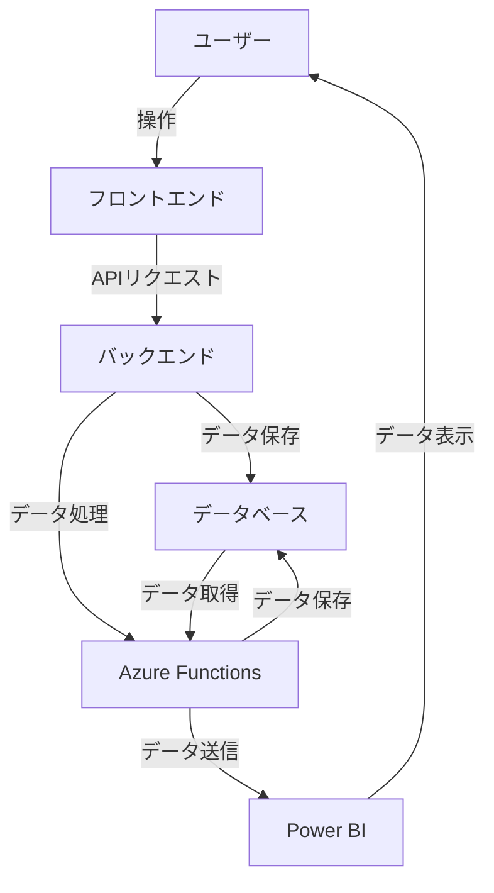
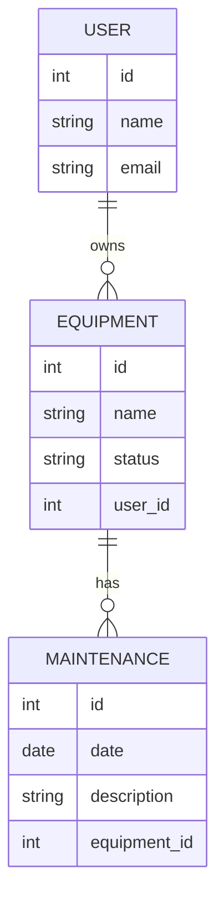
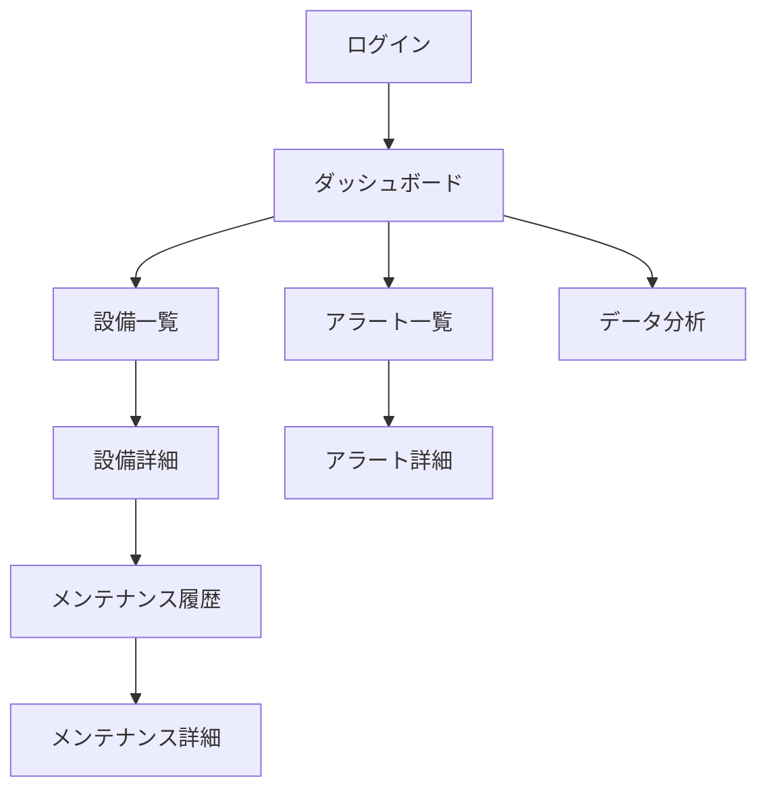
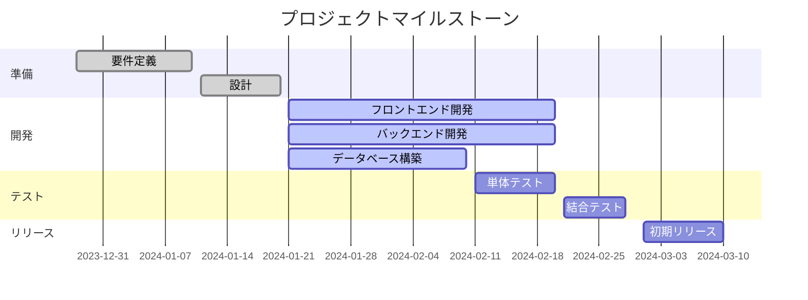

# ai-driven-development-workshop-template

## AI-Driven Development Workshop 👉 [Link](https://dev-lab-io.github.io/aoai/scenario2/home)

## 概要説明

このデモ プロジェクトは、工場設備管理アプリのプロトタイプ開発をテーマとしています。工場内の設備の稼働状況やメンテナンス情報を一元管理し、効率的な運用をサポートすることを目的としています。

### プロジェクトの目的

- **設備の稼働状況のリアルタイム監視**: センサーを活用して、設備の稼働状況をリアルタイムで監視します。
- **メンテナンス管理**: 設備のメンテナンススケジュールを管理し、予防保全を実現します。
- **データ分析**: 設備の稼働データを分析し、効率的な運用方法を提案します。

### 使用技術

- **Azure Functions**: データの処理や分析を行います。
- **Azure SQL Database**: 収集したデータを保存します。
- **Azure Cosmos DB**: IoT デバイスからのデータをリアルタイムで処理します。
- **Power BI**: データの可視化と分析結果の共有を行います。

### 期待される成果

- 設備の稼働状況をリアルタイムで把握することで、ダウンタイムを削減します。
- メンテナンスの効率化により、設備の寿命を延ばします。
- データに基づいた運用改善提案により、生産性を向上させます。

### 開発条件

- **データセット**: 本デモでは、架空の工場の設備データを使用します。
- **開発環境**: Visual Studio Code などのコードエディタを使用します。
- **言語**: Python などのプログラミング言語を使用します。
- **デプロイ先**: Azure クラウド上にデプロイします。
- **開発手法**: AI-Driven Development を採用します。

## 詳細な提案書

### 背景の確認
工場設備の稼働監視について、どんな課題がありますか？その歴史的な経緯と、実際に効果を出している具体的な事例と、失敗している事例があれば、その背景や詳細なユーザーストーリーを教えてください。

### 役割
あなたは世界有数のコンサルタントです。**ソフトウェアエンジニアリング**に非常に長けています。

### ユースケース作成のタスク
以下のユーザーストーリーから詳細な**ユースケース**を考えてください。

終了の指示があるまで、作成を続けてください。
タスクが完了したら、「タスクが完了しました」と出力してください。
タスクを完了させるために情報に不足がある場合は、その旨を伝えてください。
深呼吸をして、一つずつ取り組んでください。

### ユーザーストーリー
工場の設備管理には、いくつかの具体的な課題があります。
以下にその課題と歴史的な経緯、成功と失敗の例、そしてソフトウェアでの解決方法について詳しく説明します。

#### 課題
1. **監視対象の多さ**：
  - 多くの生産設備を同時に監視する必要があり、監視対象が多岐にわたることがあります。
  - 異常やトラブルの発生原因が多岐にわたり、判別が難しい。
2. **人手不足とスキル不足**:
  - 専門知識を持ったスタッフが不足しているため、監視の対応が限られる。
  - 人的リソースの制約があり、効率的な運用が難しい。
3. **データの正確な分析の難しさ**:
  - 適切なセンサーや測定装置の導入が必要であり、データの統合・分析が困難。
  - 異常やトラブルの早期発見が難しく、対応が遅れることがある。

#### 歴史的な経緯
工場の設備管理は、初期には人手による目視確認や定期的な巡回が主流でした。
しかし、これには限界があり、異常の早期発見や効率的な監視が難しいという課題がありました。
近年では、IoT 技術やセンサー技術の導入により、リアルタイムでのデータ収集と分析が可能となり、効率的な監視システムの導入が進んでいます。

#### 成功例
1. **リアルタイム監視で稼働率向上**:
  - ある工場では、IoT センサーを導入し、設備の稼働状況をリアルタイムで監視するシステムを導入しました。その結果、稼働率が 38% 向上し、生産性が大幅に改善されました。
2. **予知保全の実現**:
  - 予知保全システムを導入した工場では、異常の早期発見と迅速な対応が可能となり、設備の故障率を未然に防ぐことができました（10~15% の削減）。

#### 失敗例
1. **導入コストの問題**:
  - ある工場では、稼働監視システムの導入に高額なコストがかかり、予算を超過してしまいました。また、古い設備に対応できないシステムを導入したため、追加の設備投資が必要となり、結果的にコストが増大しました。
2. **データの信頼性の問題**:
  - 手動でのデータ記録に依存していた工場では、人為的ミスやデータの不正確さが問題となり、正確な分析ができず、効率の改善が進まなかった。

#### ソフトウェアでの解決方法
1. **リアルタイムデータ収集と分析**:
  - IoT センサーや AI 技術を活用し、リアルタイムでデータを収集・分析することで、異常の早期発見と迅速な対応が可能になります。
2. **自動化と予知保全**:
  - 自動化された監視システムを導入することで、人手不足やスキル不足の問題を解決し、予知保全を実現します。
3. **データの可視化と一元管理**:
  - データを一元管理し、可視化することで、設備の稼働状況をリアルタイムで把握し、効率的な監視が可能になります。

これらのソフトウェアソリューションを導入することで、
工場の設備の稼働監視における課題を効果的に解決し、生産性の向上やコスト削減を実現することができます。

## 機能要件

### アプリケーション開発の目的や背景
工場設備管理アプリの開発目的は、工場内の設備の稼働状況やメンテナンス情報を一元管理し、効率的な運用をサポートすることです。背景として、工場の設備管理における課題を解決し、生産性の向上とコスト削減を目指します。

### 対象ユーザーや利用シーン
対象ユーザーは、工場の設備管理担当者やメンテナンススタッフです。利用シーンとしては、設備の稼働状況の監視、メンテナンススケジュールの管理、異常発生時の迅速な対応などが含まれます。

### 主要な機能やサービス
- 設備の稼働状況のリアルタイム監視
- メンテナンススケジュールの管理
- 異常発生時のアラート通知
- データの可視化と分析
- 設備の履歴管理

### 画面や操作
- ダッシュボード画面: 設備の稼働状況やメンテナンス情報を一目で確認できる画面
- メンテナンス管理画面: メンテナンススケジュールの登録・編集・削除ができる画面
- アラート通知画面: 異常発生時のアラートを確認できる画面
- データ分析画面: 設備の稼働データを分析し、グラフやチャートで表示する画面

### 外部サービスとのやり取り
- IoT センサーからのデータ収集
- Azure Functions を使用したデータ処理
- Azure SQL Database へのデータ保存
- Power BI を使用したデータの可視化

### 他のアプリケーションやサービスとの依存関係
- Azure IoT Hub: IoT センサーからのデータを受信するために使用
- Azure Functions: データの処理や分析を行うために使用
- Azure SQL Database: 収集したデータを保存するために使用
- Power BI: データの可視化と分析結果の共有を行うために使用

## 非機能要件

### 可用性
システムは 24 時間 365 日稼働し、常に利用可能であることが求められます。特に、重要なメンテナンス情報やアラート通知は、即時に確認できるようにする必要があります。

### 性能・拡張性
システムは、同時に 10 人程度のユーザーが利用できる性能を持ち、将来的な機能追加やユーザー数の増加にも対応できる拡張性を持つことが求められます。

### 運用・保守性
システムの運用・保守は容易であり、定期的なバックアップや障害発生時の迅速な復旧が可能であることが求められます。特に、ユーザーの課金情報や予約情報は 24 時間 365 日すぐに復旧できるようにする必要があります。

### 移行性
現行のシステムが存在しないため、新規にシステムを構築する必要があります。将来的に他のシステムへの移行が容易であることが求められます。

### セキュリティ
システムは、個人情報や機密情報を取り扱うため、高いセキュリティが求められます。特に、データの暗号化やアクセス制御などのセキュリティ対策を講じる必要があります。

### 環境・サステナビリティ
システムは、環境に配慮した設計が求められます。例えば、太陽光発電などの再生可能エネルギーを活用することが望ましいです。また、システムの運用においても、エネルギー効率の高い方法を採用することが求められます。

## アプリケーションアーキテクチャ



## データモデル



## 画面遷移図



## プロジェクトのマイルストーン



## GitHub Copilot Extensions

### 開発環境のセットアップ

1. Node.js と npm をインストールします。
2. リポジトリをクローンし、プロジェクトディレクトリに移動します。

```bash
git clone <リポジトリのURL>
cd <プロジェクトディレクトリ>
```

### 新しい拡張機能の作成

1. Visual Studio Code 拡張機能ジェネレーターを使用して、新しい拡張機能をスキャフォールドします。

```bash
yo code
```

2. プロンプトに従って、必要な情報を入力します。

### 拡張機能の開発

1. 必要なコードと設定ファイルを作成し、拡張機能の機能を実装します。

### 拡張機能のテスト

1. `vsce` ツールを使用して、拡張機能をローカルでパッケージ化し、テストします。

```bash
npm install -g vsce
vsce package
code --install-extension <パッケージファイル名>
```

### 拡張機能の公開

1. 拡張機能に満足したら、`vsce` ツールを使用して、Visual Studio Code Marketplace に公開します。

```bash
vsce publish
```
